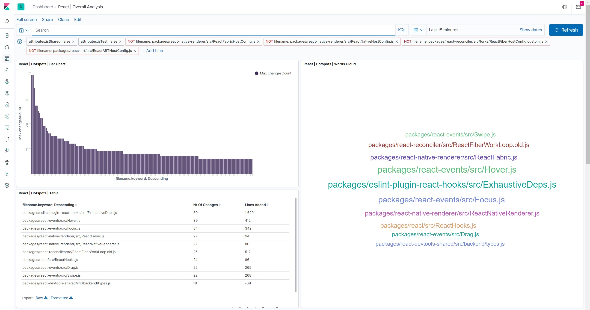
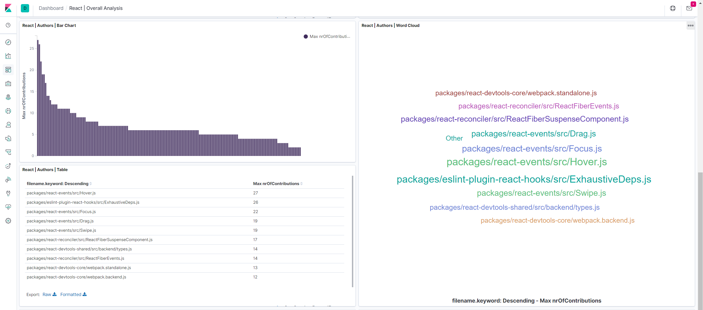

# Behavioural Code Analysis Tool

Behavioural Code Analysis Tool. It makes use of Kibana visualization tools for a customizable analysis.

### Given a list of commits this tool will analyse them and organize it from an author, file, and coupling perspectives.

### The JS script will ingest the analysis into Elastic Search, which is then accessible from Kibana.

# Use Case - React

Hotspots are the files with the most alterations - this is a potential breeding ground for bugs. As such, it should be the starting point of the analysis. In the word cloud, we can discern the top 10 hotspots files.

With Complexity trend we can notice how the file is evolving, if into a more and more complex file, or a file that has been losing complexity. Coupling is another metric that provides us invisible coupling between files. Though it's expected having coupling between classes and their unit-tests, it's not healthy having between classes.

Not having a main maintainer, a file can become a chaotic expression of ideas. It's likely here that responsability becomes dilluted, because everyone expects the others to refactor the code, but in the end nobody does it. This a phenomenon known as pluralistic ignorance.

# How To Run

## (a) Go into the project you want to analyse, then run `git log --pretty=format:'[%h] %aN %ad %s' --date=short --numstat > all.commits.txt`

## (b) Configure the `src\conf.js` with the appropriate parameters of the project.

## (c) Setup the Elastic Search and Kibana `run docker-compose.yml`

## (e) Run the JS script `node main.js commitsPath=\"..\use-cases\react\all.commits.txt\"`

## (f) Go To Kibana `http://localhost:5601/` and setup the dashboards whatever the way it's more suitable for you
